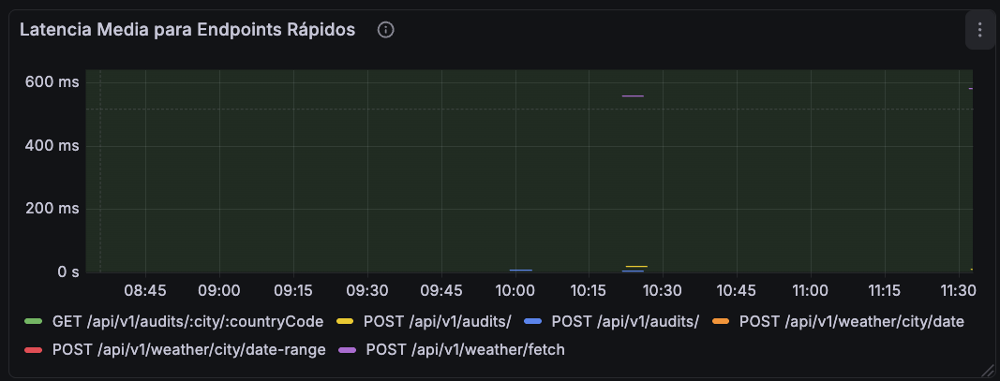
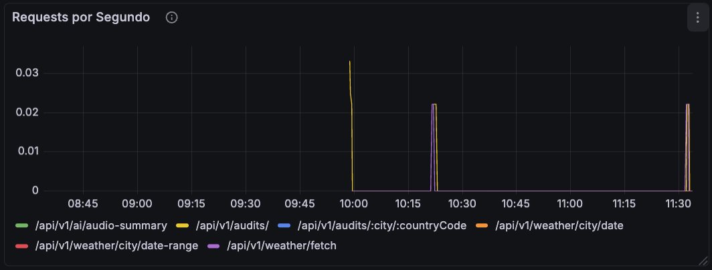
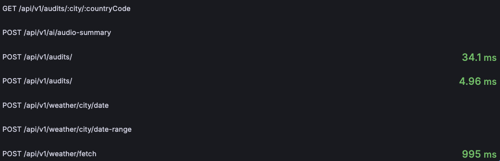
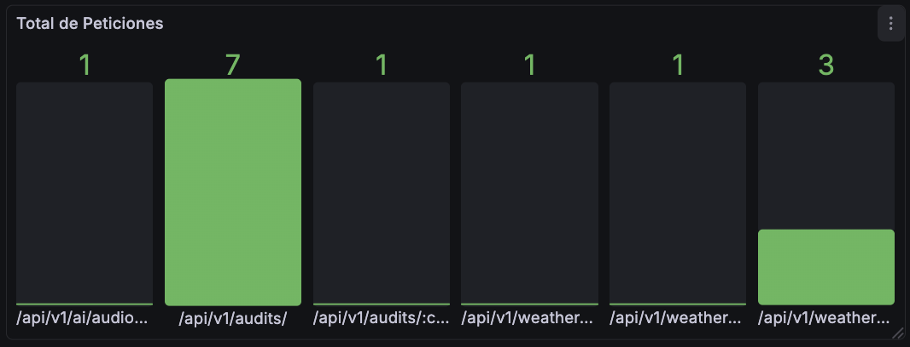

# Entregables DevDays 2025 Realizados

Este documento detalla la implementación completa de los entregables realizados del workshop.

---

## Índice

### Entregables de Nivel 1
- [N1-1: Función recursiva - Paginación de datos de la API de GitHub](#n1-1-función-recursiva-paginación-de-datos-de-la-api-de-github)
- [N1-2: Creación de métricas personalizadas](#n1-2-creación-de-métricas-personalizadas)
- [N1-3: Integración de LLM providers](#n1-3-integración-de-llm-providers)

### Propuesta de Nivel 2 Realizada
- [N2-P2-A: Auditoría sobre datos meteorológicos](#n2-p2-a-auditoría-sobre-datos-meteorológicos)
- [N2-P2-B: Audio resumen del tiempo pasado con IA](#n2-p2-b-audio-resumen-del-tiempo-pasado-con-ia)
- [N2-P2-C: Instrumentación y observabilidad con Prometheus/Grafana](#n2-p2-c-instrumenta-y-mide-el-tiempo-de-respuesta-de-la-api-de-weather)

---

# ENTREGABLES DE NIVEL 1 REALIZADOS

## N1-1: Función recursiva: paginación de datos de la API de GitHub

**Descripción:** Creación de una función genérica que consuma de la API REST de GitHub para poder obtener datos. Si hay varias páginas de información, la función debe paginar de forma automática para obtener toda la información.

### Solución implementada

Para resolver este entregable hemos creado un servicio `github.service.js` basándonos en la documentación oficial de la API de GitHub. Aunque GitHub ya ofrece la herramienta Octokit, implementamos la función manualmente para que sea recursiva y cumpla mejor con los criterios del entregable.

#### Funcionamiento de la función recursiva

La función recibe principalmente la **URL** de la API de GitHub que se quiere consultar y un conjunto de **parámetros** opcionales (que pueden variar según la url que se esté probando). El flujo de ejecución es el siguiente:

1. **Validación y llamada inicial:** Verificamos que la URL esté completa y hacemos la llamada mediante axios añadiendo los parámetros dados y especificando 100 elementos por página (máximo permitido por GitHub para maximizar eficiencia).

2. **Configuración de headers:** Incluimos las cabeceras que recomienda GitHub, con un Bearer token para evitar alcanzar el rate limit demasiado rápido (algo común al paginar automáticamente).

3. **Acumulación de datos:** Al recibir la respuesta, acumulamos los datos en una lista y observamos la cabecera `Link`, que GitHub utiliza para referenciar las páginas mediante el campo `rel`.

4. **Recursión o caso base:**
   - Si `rel="next"` existe → hay más páginas, llamamos recursivamente con la siguiente URL
   - Si no existe → caso base alcanzado, devolvemos todos los datos acumulados

#### Endpoints disponibles

Esta lógica genérica se ha integrado en tres endpoints diferentes:

**1. Endpoint genérico** (para probar de forma flexible):
```
POST http://localhost:3000/api/v1/github/fetch
Body: {
  "url": "/repos/tj/git-extras/commits",
  "params": { "per_page": 10 }
}
```

**2. Endpoint de Pull Requests** (nuevo módulo completo):
```
POST http://localhost:3000/api/v1/pullrequests/fetch
Body: {
  "repository": {
    "owner": "tj",
    "name": "git-extras"
  }
}
```

**3. Endpoint de Issues** (adaptado con la función recursiva):
```
POST http://localhost:3000/api/v1/issues/fetch
Body: {
  "repository": {
    "owner": "glzr-io",
    "name": "glazewm"
  }
}
```

### Módulo de Pull Requests

Además de adaptar la lógica al módulo de Issues ya existente y crear la función recursiva, he creado un **módulo de Pull Requests** para repasar y ampliar lo aprendido en el taller. Este módulo:

- Utiliza la función recursiva genérica
- Implementa un mapper modularizado para separación de responsabilidades
- Permite filtrar por estado de PR

### Nota sobre Swagger

El endpoint genérico puede presentar problemas de carga en Swagger cuando devuelve grandes cantidades de datos. Se recomienda usar los ejemplos allí proporcionados directamente o probar con herramientas como Postman para volúmenes grandes.

## N1-2: Creación de métricas personalizadas

**Descripción:** Definir e instrumentar una nueva métrica distinta a la explicada en el tema 7. La métrica debe medir algún aspecto relevante del comportamiento o estado del sistema y no puede ser de tipo contador simple. El objetivo es evaluar la capacidad para identificar qué información es útil observar y aprender otro tipo de métricas.

### Solución implementada

Para resolver este entregable hemos creado **dos métricas personalizadas** en el servicio de paginación recursiva `github.service.js`:

1. **Inter-Page Latency** (Histogram) - Latencia entre peticiones consecutivas
2. **Error Rate** (Observable Gauge) - Tasa de error con ventana deslizante

#### Métrica 1: Inter-Page Latency (Histogram)

**Tipo:** Histogram
**Nombre:** `github.api.inter_page_latency`
**Propósito:** Medir el tiempo entre peticiones consecutivas durante la paginación para identificar problemas de latencia o rendimiento del servidor sobre la marcha.

**Implementación:**

1. Al inicio de la recursión, almacenamos la fecha actual en `lastGithubApiCallTimestamp`
2. En cada llamada recursiva, calculamos la diferencia entre la fecha actual y la almacenada (en ms)
3. Registramos esta diferencia en el histograma con atributos de `endpoint` y `page`
4. Al llegar al caso base, reseteamos la variable para evitar contaminar llamadas independientes

El histograma nos permite ver en qué percentil se está moviendo la latencia actual cada vez que se exportan las métricas.

#### Métrica 2: Error Rate (Observable Gauge)

**Tipo:** Observable Gauge
**Nombre:** `github.api.error_rate`
**Propósito:** Calcular la tasa de error de las últimas 100 peticiones usando una ventana deslizante.

**Implementación:**

1. **Registro de resultados:** La función auxiliar `recordRequestResult` registra cada petición como `'success'` o `'error'` según el resultado
2. **Ventana deslizante:** Los resultados se almacenan en `recentGithubRequests`. Si la lista supera el tamaño máximo (100, definido en `MAX_WINDOWS_SIZE`), hacemos `shift()` para eliminar el elemento más antiguo
3. **Cálculo automático:** Cuando se activa la exportación según el intervalo configurado en `otel.js`, un callback calcula el porcentaje de errores sobre el total de peticiones en la ventana

Esta métrica nos permite monitorizar la salud de la integración con GitHub API en tiempo real.

## N1-3: Integración de LLM providers

**Descripción:** Usar Ollama local en lugar de llamar a OpenAI.

### Solución implementada

Para cumplir con el entregable, siguiendo los pasos del taller, solo era necesario cambiar la importación del controlador `ai.controller.js` de `'../services/openai.service.js'` a `'../services/ollama.service.js'`.

Sin embargo, para poder usar Ollama local es necesario tener el modelo instalado, ya que si no la llamada devolverá un error. Por ello, para facilitar la corrección, se ha creado un script de verificación de requisitos.

#### Script de verificación: `check-ollama.js`

Este script multiplataforma verifica que Ollama esté correctamente configurado antes de ejecutar la aplicación. Su funcionamiento es el siguiente:

1. **Detección del sistema operativo:** Identifica si es Windows, macOS o Linux para dar instrucciones de instalación personalizadas

2. **Verificación de instalación:** Ejecuta `ollama --version` para comprobar que Ollama esté instalado en el sistema

3. **Verificación del modelo:** Ejecuta `ollama list` para comprobar que el modelo configurado (definido en `OLLAMA_MODEL`) esté disponible localmente. Este comando también activa el proceso de Ollama si no está corriendo

4. **Instrucciones:** Si falta Ollama o el modelo, proporciona instrucciones específicas según el sistema operativo detectado

**Ejecución del script:**
```bash
node src/scripts/check-ollama.js
```

El script termina con código 0 si todo está configurado correctamente, o código 1 si falta algún requisito.

# PROPUESTA DE NIVEL 2 REALIZADA

Se ha decidido realizar la segunda propuesta de nivel dos. Toda la implementación se ha realizado en el directorio n2-p2-weather-app.

## N2-P2-A: Auditoría sobre datos meteorológicos

**Descripción:** Conexión con OpenMeteo para obtener el histórico meteorológico de las últimas semanas de una ciudad. A partir de esos datos, se calcula la temperatura media semanal y se verifica, para cada semana, si se cumple un umbral de temperatura definido. Por ejemplo, comprobar si la temperatura media semanal en Sevilla es superior a 18 °C.

### Solución implementada

Para realizar esta tarea, se ha creado un **módulo completo de gestión meteorológica** que permite obtener datos históricos de OpenMeteo y almacenarlos en la aplicación.

#### Modelo de datos: `weather.model.js`

El modelo almacena los siguientes campos:
- **city, countryCode:** Identificación de la ubicación
- **latitude, longitude:** Coordenadas geográficas (necesarias para OpenMeteo)
- **date:** Fecha del registro
- **temperatureMean:** Temperatura media del día (obtenida con el parámetro `temperature_2m_mean`)
- **weatherDescription:** Descripción del tiempo traducida desde los códigos de OpenMeteo (usando inicialmente el parámetro `weather_code`)
- **createdAt:** Metadatos de creación

**Aspectos clave:**

1. **Índice único compuesto:** `{city, countryCode, date}` que evita duplicados para la misma ciudad/fecha gracias al uso de countryCode
2. **weatherCodeMapper:** Traduce los códigos numéricos de OpenMeteo a descripciones más legibles y traducidas
3. **Parseo de arrays:** OpenMeteo devuelve arrays separados de fechas, temperaturas y códigos. El servicio los transforma en registros individuales

#### Integración de APIs externas

**1. Geocoding API (geocoding.service.js):**

Convierte nombres de ciudades en coordenadas geográficas, ya que OpenMeteo solo acepta latitud/longitud.

- Si se pasa `countryCode`: busca la ciudad en ese país específico
- Si no se pasa: busca la ciudad globalmente y **usa automáticamente el código del primer resultado** (esto es importante porque ese código se almacena en BD para evitar conflictos de ciudades homónimas)

Devuelve: `{latitude, longitude, countryCode}`

**2. OpenMeteo Archive API (openmeteo.service.js):**

Obtiene datos históricos meteorológicos para un rango de fechas.

- Calcula el rango desde "ayer" (no "hoy", para evitar datos incompletos del día actual)
- Solicita parámetros: `temperature_2m_mean` y `weather_code`
- El rango se define por `weeksBack` (número de semanas hacia atrás)

**3. Weather Service (weather.service.js):**

Orquesta el guardado de datos con las siguientes funciones:

1. **Mapeo:** Transforma la respuesta de OpenMeteo al modelo, filtrando días sin datos
2. **Deduplicación:** Verifica qué registros ya existen en BD para insertar solo los nuevos
3. **Formateo:** Convierte fechas a formato `YYYY-MM-DD` para respuestas más amigables

#### Flujo del endpoint principal: `fetchAndSaveHistoricalWeather`

El controlador `weather.controller.js` expone el endpoint principal que ejecuta estos pasos:

1. **Geocoding:** Obtiene coordenadas (y countryCode automático) de la ciudad
2. **OpenMeteo:** Recupera datos históricos para el rango solicitado
3. **Guardado:** Almacena solo registros nuevos en BD
4. **Respuesta:** Devuelve todos los registros procesados

**Endpoint de prueba:**
```
POST http://localhost:3001/api/v1/weather/fetch
Body: {
  "city": "Sevilla",
  "countryCode": "CO",
  "weeksBack": 1
}
```

#### Módulo de auditorías meteorológicas

Una vez disponemos de los datos meteorológicos en nuestra base de datos, podemos proceder a realizar auditorías sobre ellos.

**Modelo de datos: `audit.model.js`**

El modelo de auditoría utiliza un **auditId propio** (UUID generado automáticamente) para evitar exponer el `_id` de MongoDB en los endpoints públicos.

Campos principales:
- **city, countryCode:** Identificación de la ubicación auditada
- **dateFrom, dateTo:** Rango temporal de la auditoría
- **thresholdTemp:** Umbral de temperatura contra el que se evalúa
- **compliant:** Booleano que indica si la auditoría cumple globalmente
- **createdAt:** Fecha de creación de la auditoría
- **metadata:** Objeto con estadísticas agregadas:
  - `totalWeeks`: Total de semanas evaluadas
  - `weeksCompliant`: Semanas que cumplen el umbral
  - `weeksNonCompliant`: Semanas que no cumplen
  - `complianceRate`: Porcentaje de cumplimiento (0-100)
  - `rule`: Regla aplicada (guardada por si cambia en el futuro)
- **evidences:** Array de evidencias por semana

**Esquema de evidencias (`evidenceSchema`):**

Cada semana evaluada genera una evidencia individual con los siguientes campos:
- **weekNumber:** Número secuencial de la semana evaluada
- **weekStart, weekEnd:** Fechas de inicio y fin de la semana
- **avgTemp:** Temperatura media de esa semana
- **daysInWeek:** Número de días evaluados de la semana (puede ser parcial si el rango de auditoría no cubre toda la semana)
- **compliant:** Booleano indicando si esta semana específica cumple el umbral

**Transformación de respuestas:**

El modelo incluye un convertidor `toJSON` que:
- Elimina los campos internos de Mongoose (`_id`, `__v`)
- Formatea todas las fechas al formato `YYYY-MM-DD`
- Se aplica automáticamente al devolver respuestas en la API

**Servicio de auditoría: `audit.service.js`**

El endpoint principal para crear auditorías ejecuta tres pasos fundamentales:

**Parámetros de entrada:**
- `city`: Nombre de la ciudad
- `countryCode`: Código ISO del país
- `dateFrom`, `dateTo`: Fechas del rango a auditar
- `thresholdTemp`: Umbral de temperatura

**Paso 1: Obtención de datos meteorológicos**

Se recuperan los datos meteorológicos de la ciudad en el intervalo especificado. Si falta **un solo dato meteorológico o más**, el servicio devuelve un error indicando al usuario que debe hacer un POST al endpoint de obtención de datos de OpenMeteo con el `weeksBack` necesario. Esto es fundamental ya que **todos los datos deben estar disponibles** en la base de datos para que el endpoint funcione correctamente.

**Paso 2: Procesamiento y agrupación por semanas**

Si los datos están completos, se procesan y agrupan por semana mediante un `Map`. Para cada semana:

1. Se almacenan en arrays los días existentes y sus temperaturas
2. Se calcula la evidencia de la semana:
   - **weekNumber:** Contador secuencial
   - **weekStart, weekEnd:** Obtenidas a partir del primer día de la semana
   - **avgTemp:** Promedio de las temperaturas de los días existentes
   - **daysInWeek:** Tamaño del array de días

**Uso de dayjs:**

Es fundamental el uso de la librería `dayjs` para trabajar de manera rápida y flexible con fechas:
- Obtener el número ISO de la semana para la creación del mapa
- Determinar correctamente a qué semana pertenece una fecha
- Calcular los días de inicio y fin de una semana a partir de la primera fecha (internamente usa los jueves de cada semana como referencia)

**Paso 3: Cálculo de cumplimiento y almacenamiento**

Una vez agrupados los datos por semana y calculada la temperatura promedio de cada una:

1. Se mapean los datos agrupados añadiendo el campo `compliant` para cada semana:
   - `compliant = avgTemp >= thresholdTemp`

2. Se guarda la auditoría completando el modelo con:
   - Metadata calculada (totales, porcentajes, regla)
   - Evidencias procesadas por semana
   - Campos de identificación y timestamp

**Ejemplo de uso:**

Primero, obtener los datos meteorológicos necesarios (siguiendo el mensaje de error si no existen):

```
POST http://localhost:3001/api/v1/weather/fetch
Body: {
  "city": "Zaragoza",
  "countryCode": "ES",
  "weeksBack": 3
}
```

Mensaje de error típico si faltan datos:
```json
{
  "message": "No weather data found for Zaragoza, ES between 2025-12-26 and 2026-01-01. Please fetch data using: POST /api/v1/weather/fetch with appropriate date range.",
  "details": {
    "fetchRequest": {
      "method": "POST",
      "endpoint": "/api/v1/weather/fetch",
      "body": {
        "city": "Zaragoza",
        "countryCode": "ES",
        "weeksBack": 3
      }
    }
  }
}
```

Luego, crear la auditoría:

```
POST http://localhost:3001/api/v1/audits
Body: {
  "city": "Zaragoza",
  "countryCode": "ES",
  "dateFrom": "2025-12-26",
  "dateTo": "2026-01-01",
  "thresholdTemp": 7.3
}
```

**Endpoints CRUD adicionales**

El módulo dispone de métodos CRUD generales para facilitar las pruebas:

1. **Obtener auditoría por auditId:**
   ```
   GET /api/v1/audits/:auditId
   ```

2. **Obtener todas las auditorías:**
   ```
   GET /api/v1/audits
   ```

3. **Obtener auditorías por ciudad:**
   ```
   GET /api/v1/audits/:city/:countryCode
   ```
   Con parámetros opcionales de rango de fechas.

Los dos últimos métodos admiten parámetros adicionales de query:
- **limit:** Limitar el número de elementos de salida
- **skip:** Saltar X elementos (paginación básica)
- **sort:** Ordenación según campo preferido (objeto JSON)

Ejemplo con ordenación:
```
GET http://localhost:3001/api/v1/audits?sort={"createdAt": 1}
```

## N2-P2-B: Audio resumen del tiempo pasado con IA

**Descripción:** Endpoint para obtener un archivo de audio con IA que nos haga un resumen del tiempo de los 7 últimos días.

### Solución implementada

Este módulo implementa un endpoint único que genera resúmenes de audio sin persistencia en base de datos. En una aplicación real sería útil almacenar metadatos para controlar costes evitando llamadas duplicadas a OpenAI y servir  audios previamente generados.

#### Flujo del endpoint: `POST /api/v1/audio-summary`

**Parámetros de entrada:**
```json
{
  "city": "Zaragoza",
  "countryCode": "ES"
}
```

**Proceso de ejecución:**

**1. Cálculo del rango temporal**

Utiliza `calculateDateRange()` de OpenMeteo Service para obtener las fechas de la última semana, calculando desde ayer (no hoy, para evitar datos que podrían estar incompletos).

**2. Obtención de datos meteorológicos**

Recupera los 7 días de datos desde la base de datos usando WeatherService. Si falta algún dato, devuelve un error con las instrucciones de que es necesario obtener primero los datos de OpenMeteo con el weeksBack configurado a uno.

**3. Compactación de información (`compactWeatherInfo` en OpenAI Service)**

Transforma los datos en un formato legible para el LLM:

```javascript
// Extrae información en 3 arrays paralelos
const weekData = {
  dates: [],           // ['2026-01-07', '2026-01-08', ...]
  temperatures: [],    // [8.5, 9.2, ...]
  conditions: []       // ['nublado', 'despejado', ...]
};

// Convierte a tabla markdown más legible para el LLM
const dataTable = weekData.dates
  .map((date, i) => `- ${date}: ${weekData.temperatures[i]}°C, ${weekData.conditions[i]}`)
  .join('\n');
```

**Resultado:**
```
- 2026-01-07: 8.5°C, nublado
- 2026-01-08: 9.2°C, despejado
...
```

Este formato tabular permite al LLM interpretar mejor los datos que si se enviara el JSON crudo.

**4. Generación de audio (`generateAudioWeatherSummary`)**

**Configuración del modelo:**

Se usa **Chat Completions API** en lugar de **Responses API** porque esta última aún no soporta salida de audio. Así, en un mismo prompt podemos generar el resumen meteorológico de los siete días y obtener la salida como transcripción en audio.

```javascript
const response = await openai.chat.completions.create({
  model: 'gpt-audio',              // Modelo con capacidad de audio
  modalities: ['text', 'audio'],   // Salida dual: texto + audio
  audio: {
    voice: 'alloy',                // Voz elegida
    format: 'mp3'                  // Formato de salida
  },
  store: true,                     // Guardar logs en dashboard OpenAI
  messages: [...]
});
```

**Configuración de roles:**

1. **Role: system** - Define el comportamiento del LLM:
   ```
   Eres un meteorólogo profesional.
   Tu objetivo es crear un resumen natural y conversacional para audio.
   Máximo 150 palabras. Tono amigable y profesional en español.
   ```

2. **Role: user** - Especifica la tarea concreta:
   ```
   Genera un resumen del tiempo de los últimos 7 días en Zaragoza, ES.

   Datos meteorológicos de la semana:
   [tabla de datos]

   Incluye:
   - Una introducción breve y atractiva
   - Temperatura promedio y rango (máxima y mínima)
   - Condiciones climáticas predominantes
   - 1-2 detalles interesantes, si existen
   - Un cierre natural

   Importante: Genera UN SOLO PÁRRAFO fluido y conversacional,
   listo para ser leído en voz alta.
   ```

**Procesamiento de respuesta:**

```javascript
const message = response.choices[0].message;

return {
  transcript: message.audio.transcript || message.content,  // Texto generado
  audioBuffer: Buffer.from(message.audio.data, 'base64')   // Audio MP3 en bytes
};
```

**5. Respuesta HTTP con audio**

El controlador devuelve el archivo MP3 directamente con las cabeceras apropiadas:

```javascript
res.set({
  'Content-Type': 'audio/mpeg',
  'Content-Length': audioBuffer.length,
  'Content-Disposition': 'attachment; filename="resumen-Zaragoza-ES.mp3"',
  'X-Transcript': encodeURIComponent(transcript)  // Transcripción en cabecera codificada
});

res.send(audioBuffer);
```

**Características de la respuesta:**
- **Content-Type:** `audio/mpeg` - Permite reproducción directa en navegadores/Postman
- **Content-Disposition:** Sugiere nombre de archivo para descarga
- **X-Transcript:** Cabecera custom con la transcripción del audio (URL-encoded)

#### Ventajas de esta implementación

1. **Resúmenes originales y contextuales:**
   - El LLM genera narraciones originales en cada llamada
   - Detecta patrones interesantes en los datos (ej: "la temperatura fue inusualmente estable esta semana")

**Ejemplo de uso:**

```bash
POST http://localhost:3001/api/v1/audio-summary

{
  "city": "Sevilla",
  "countryCode": "ES"
}
```

**La mejor alternativa:** Esta aproximación resulta más interesante que definir un prompt general que se adapta a los diferentes datos, ya que el LLM puede detectar patrones en cada conjunto y dar siempre respuestas originales, de manera que usar el endpoint no resulte repetitivo y aburrido.

## N2-P2-C: Instrumenta y mide el tiempo de respuesta de la API de Weather.

**Descripción:** Instrumenta la aplicación de N2-P2-A (la que consulta el histórico meteorológico de OpenMeteo) para medir el tiempo de respuesta de cada endpoint y exponer estas métricas a Prometheus. Configura alertas si el tiempo medio de respuesta supera un umbral definido o visualiza los datos en un dashboard (Grafana).

### Solución implementada

Este módulo implementa un stack completo de observabilidad usando OpenTelemetry, Prometheus y Grafana con aprovisionamiento como código.

#### 1. Instrumentación con OpenTelemetry (`otel.js`)

**Configuración del exportador de Prometheus:**

```javascript
const prometheusExporter = new PrometheusExporter({
  port: 9464  // Puerto HTTP independiente para métricas
});
```

Crea un servidor HTTP que expone las métricas en el endpoint `http://localhost:9464/metrics` en formato compatible con Prometheus.

**Configuración del Meter Provider:**

```javascript
const meterProvider = new MeterProvider({
  readers: [prometheusExporter]  // Conecta el meter con el exportador
});

metrics.setGlobalMeterProvider(meterProvider);  // Registro global
const meter = metrics.getMeter('weather-api');   // Meter de la aplicación
```

**Métrica principal: Histograma de duración HTTP**

```javascript
export const httpRequestDuration = meter.createHistogram(
  'http_request_durations_seconds',
  {
    description: 'Duration of HTTP requests in seconds',
    unit: 'seconds',
    advice: {
      explicitBucketBoundaries: [
        0.001, 0.005, 0.01, 0.05, 0.1, 0.5, 1, 2.5, 5, 10, 20, 30
      ]
    }
  }
);
```

**Buckets personalizados:**

Los buckets están optimizados para capturar tanto endpoints rápidos (~10-100ms) como el endpoint de IA (~5-30s):

Esto permite que los percentiles se distribuyan correctamente en Grafana sin que los valores del endpoint de IA saturen las visualizaciones.

#### 2. Middleware de medición (`app.js`)

**Implementación:**

```javascript
app.use((req, res, next) => {
  const startTime = Date.now();

  res.on('finish', () => {
    const duration = (Date.now() - startTime) / 1000;  // ms → segundos

    httpRequestDuration.record(duration, {
      method: req.method,
      route: req.baseUrl + req.route?.path,
      status_code: res.statusCode.toString()
    });
  });

  next();
});
```

**Flujo de medición:**

1. **Inicio:** Captura timestamp al recibir la petición
2. **Evento 'finish':** Express emite este evento cuando termina la respuesta
3. **Cálculo:** Diferencia entre timestamps convertida a segundos
4. **Registro:** Almacena en histograma con atributos (método, ruta, status code)

#### 3. Configuración de Prometheus (`prometheus.yml`)

```yaml
global:
  scrape_interval: 15s  # Frecuencia de recolección de datos

scrape_configs:
  - job_name: 'weather-api'
    static_configs:
      - targets: ['weather-app:9464']  # Servicio Docker Compose
```

Prometheus extrae métricas del endpoint `/metrics` de la aplicación cada 15 segundos.

#### 4. Provisioning de Grafana

**¿Por qué provisioning?**

Configurar Grafana mediante archivos de código (YAML/JSON) en lugar de la interfaz garantiza:
- **Reproducibilidad:** `docker-compose up` configura todo automáticamente
- **Versionado:** Dashboards y alertas en Git junto al código
- **Consistencia:** Mismo estado en todos los entornos

**Estructura de provisioning:**

```
infrastructure/grafana/provisioning/
├── datasources/
│   └── prometheus-datasource.yml   # Configuración del datasource
├── dashboards/
│   ├── dashboard-provider.yml      # Configuración de carga
│   └── weather-dashboard.json      # Dashboard completo
└── alerting/
    ├── contact-points.yml          # Canales de notificación
    ├── notification-policies.yml   # Políticas de enrutamiento
    └── alert-rules.yml             # Reglas de alerta
```

**Datasource de Prometheus (`prometheus-datasource.yml`):**

```yaml
datasources:
  - name: Prometheus
    uid: prometheus              # UID fijo para referencias
    type: prometheus
    access: proxy                # Grafana hace las peticiones
    url: http://prometheus:9090  # URL interna Docker Compose
    isDefault: true
    jsonData:
      httpMethod: POST
      timeInterval: 15s          # Coincide con scrape_interval
    editable: false              # No editable desde UI
```

**Provider de dashboards (`dashboard-provider.yml`):**

```yaml
providers:
  - name: 'Weather API Dashboards'
    type: file
    allowUiUpdates: true              # Permitir edición en UI
    updateIntervalSeconds: 15         # Recarga automática cada 15s
    options:
      path: /etc/grafana/provisioning/dashboards
```

#### 5. Dashboard de métricas (`weather-dashboard.json`)

**Panel 1: Latencia Media para Endpoints Rápidos**

```promql
rate(http_request_durations_seconds_sum{route!~"/api/v1/ai.*"}[5m])
/
rate(http_request_durations_seconds_count{route!~"/api/v1/ai.*"}[5m])
```

- **Métrica:** Tiempo medio de respuesta en segundos
- **Ventana:** Últimos 5 minutos
- **Filtro:** Excluye endpoint de IA
- **Thresholds configurados:** Rojo > 3s

**Justificación del intervalo [5m]:**

Si se usa un intervalo sin límite, Prometheus acumula métricas desde el arranque de la aplicación. Con el tiempo, los cambios en el promedio serían imperceptibles. La ventana de 5 minutos permite observar comportamientos cambiantes en tiempo casi real.

**Panel 2: Latencia Media Endpoint IA**

```promql
rate(http_request_durations_seconds_sum{route=~"/api/v1/ai.*"}[5m])
/
rate(http_request_durations_seconds_count{route=~"/api/v1/ai.*"}[5m])
```

- **Filtro:** Solo endpoint de IA
- **Thresholds configurados:** Rojo > 20s

**Visualización de panel de endpoints rápidos:**



**Panel 3: Requests por Segundo**

```promql
sum(rate(http_request_durations_seconds_count[1m])) by (route)
```

- **Métrica:** Número de peticiones por segundo
- **Ventana:** Último minuto
- **Agrupación:** Por ruta (`by (route)`)

**Visualización:**



**Panel 4: Percentil 99 de latencia**

```promql
histogram_quantile(0.99, rate(http_request_durations_seconds_bucket[5m]))
```

- **Métrica:** El 99% de las peticiones tardan menos de X segundos
- **Tipo:** Panel "Stat"

**Visualización:**



**Panel 5: Total de Peticiones**

```promql
sum(http_request_durations_seconds_count) by (route)
```

- **Métrica:** Total acumulado desde el arranque
- **Agrupación:** Por ruta
- **Visualización:** Bar gauge

**Visualización:**



#### 6. Sistema de alertas

**Regla de alerta (`alert-rules.yml`):**

```yaml
groups:
  - name: Endpoints Delay
    folder: alerts
    interval: 5m              # Evaluar cada 5 minutos
    rules:
      - title: Latencia de IA excesiva
        condition: C
        for: 5m               # Esperar 5 min antes de alertar
        data:
          - refId: A
            datasourceUid: prometheus
            expr: rate(http_request_durations_seconds_sum{route=~"/api/v1/ai.*"}[5m])
                  / rate(http_request_durations_seconds_count{route=~"/api/v1/ai.*"}[5m])

          - refId: C
            datasourceUid: __expr__
            type: threshold
            expression: A
            conditions:
              - evaluator:
                  type: gt      # Greater than
                  params: [20]  # Umbral: 20 segundos
                reducer:
                  type: last    # Usar último valor

        noDataState: OK         # Si no hay datos, no alertar
        execErrState: Alerting  # Si hay error, sí alertar

        annotations:
          summary: La latencia del endpoint de IA ha superado los 20 segundos
          description: El tiempo de respuesta promedio es {{ $values.A.Value }}s

        labels:
          severity: warning
          endpoint: ai
```

**Flujo de evaluación:**

1. Query A obtiene latencia media del endpoint IA
2. Condición C evalúa si A > 20 segundos
3. Si se cumple durante **5 minutos consecutivos**, se dispara alerta
4. Se envía notificación según políticas configuradas

**Contact points (`contact-points.yml`):**

```yaml
contactPoints:
  - name: email-notifications
    receivers:
      - type: email
        settings:
          addresses: antonito.rodriguez42@gmail.com
          singleEmail: true
          subject: "[Grafana Alert] {{ .CommonLabels.alertname }}"
          message: |
            Estado: {{ .Status }}
            Resumen: {{ .Annotations.summary }}
            Descripción: {{ .Annotations.description }}
```

**Políticas de notificación (`notification-policies.yml`):**

```yaml
policies:
  - receiver: email-notifications
    group_by: ['alertname', 'grafana_folder']  # Agrupar alertas similares
    group_wait: 30s                            # Esperar 30s antes de enviar
    group_interval: 5m                         # Enviar actualizaciones cada 5 min
    repeat_interval: 4h                        # Re-enviar cada 4h si persiste
```

**Comportamiento de agrupación:**

- Múltiples alertas con el mismo `alertname` se agrupan en un solo email
- Espera 30s para recopilar alertas relacionadas (para evitar spam)
- Si la alerta persiste, reenvía cada 4 horas como recordatorio

#### Importancia del provisioning

**Sin provisioning:**

Si solo configuras desde la interfaz, los dashboards y alertas se almacenan en la base de datos interna de Grafana. Al destruir el contenedor (`docker-compose down -v`), **se pierde toda la configuración**.

#### Acceso a servicios

- **Aplicación Weather API:** `http://localhost:3001`
- **Métricas OpenTelemetry:** `http://localhost:9464/metrics`
- **Prometheus:** `http://localhost:9090`
- **Grafana:** `http://localhost:3003` (admin/admin)